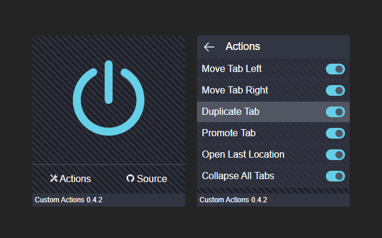
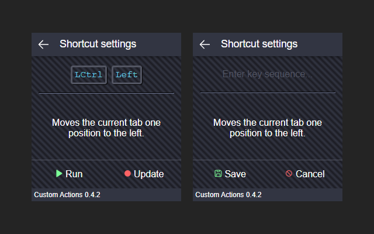

# Custom Actions extension

Custom keyboard actions for chrome. Now available on the <a href="https://chromewebstore.google.com/detail/custom-actions/glbciamkigkehloillocfhpdiiomboid">Chrome Web Store</a>!

## Default actions

* Ctrl+Up: Duplicate the current tab
* Ctrl+Left: Move the current tab left
* Ctrl+Right: Move the current tab right
* Ctrl+Down: Move the current tab to it's own window
* Alt+Shift+Left: Open the last visited location in a new tab
* Alt+Down: Collapse all tabs into the same window

## Screenshots

Main landing screen and Actions list

Shortcut settings

## How it works

The keyup and keydown event listeners are loaded in a content script (src/script.ts) which is declared in the manifest under 'content_scripts'. The content script is injected into tabs within the browser when they are created. 

When key events are detected, the content script sends actions through messages to the service worker (src/sw.ts) which is registered in the manifest under 'background > service_worker.'
